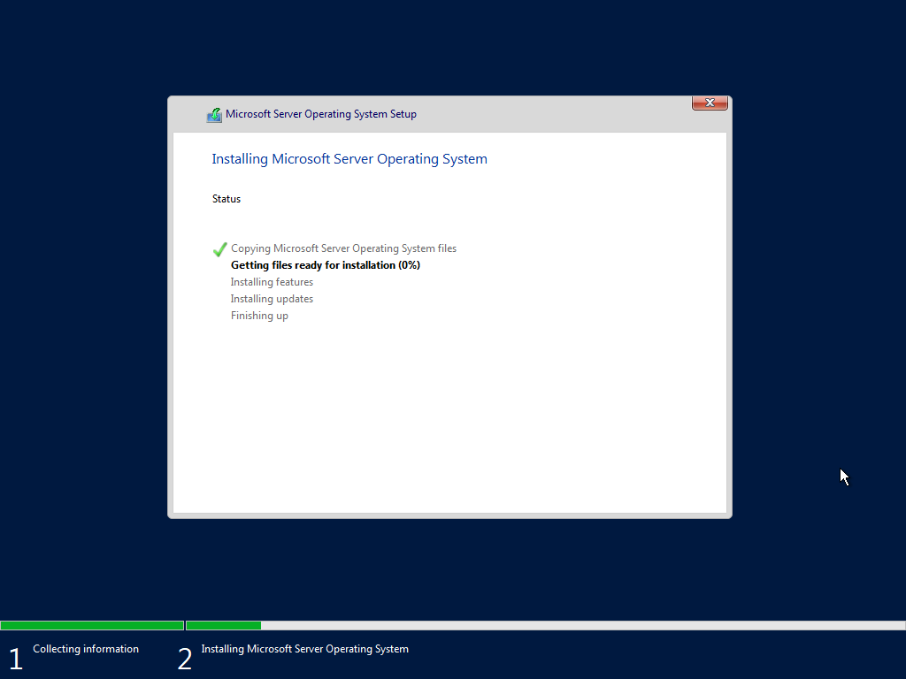
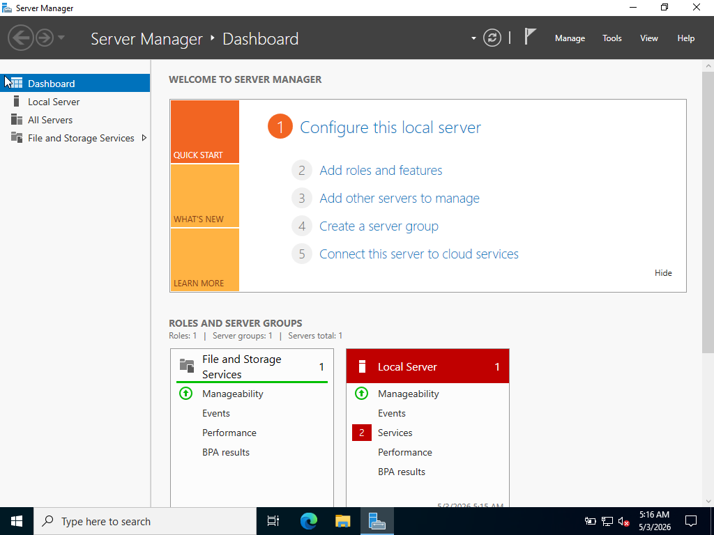
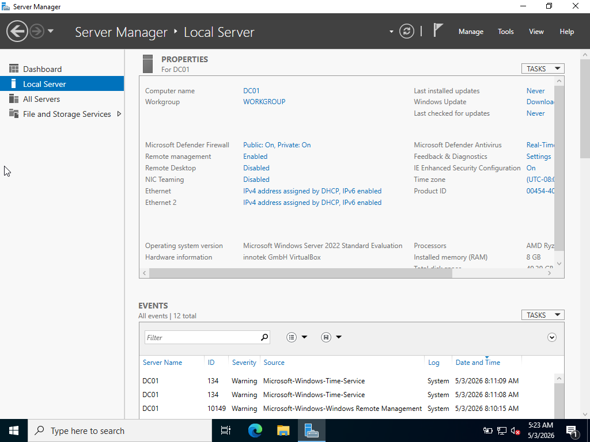
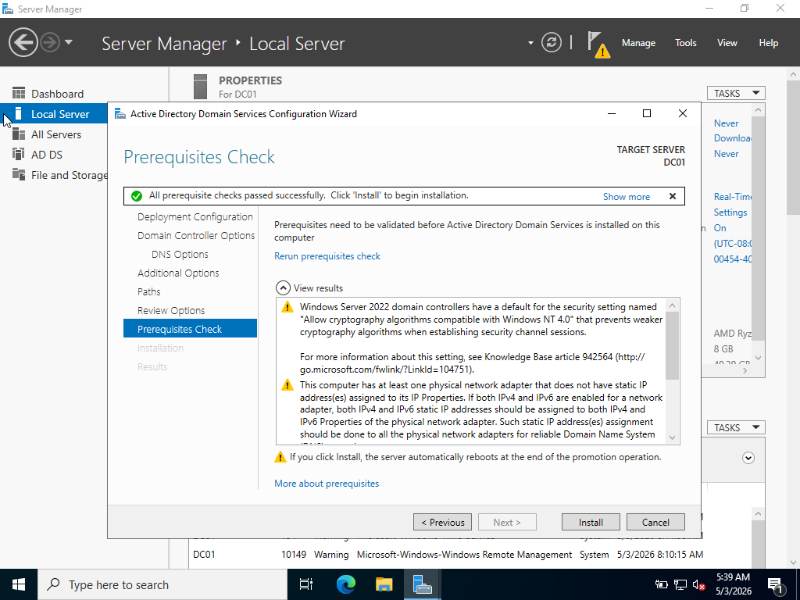
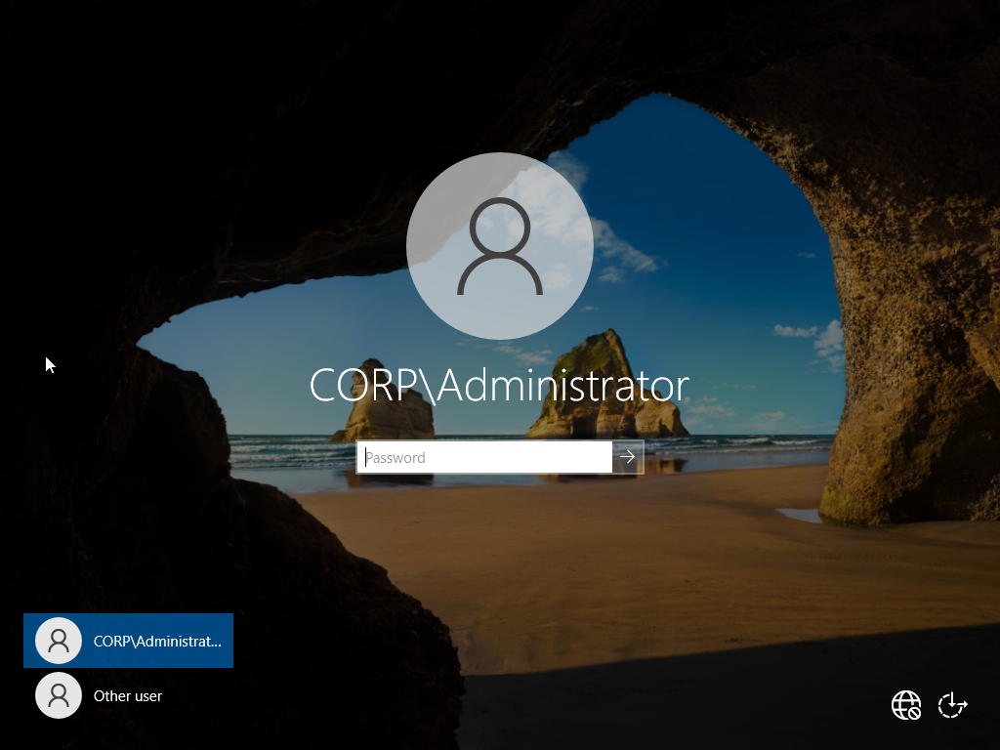
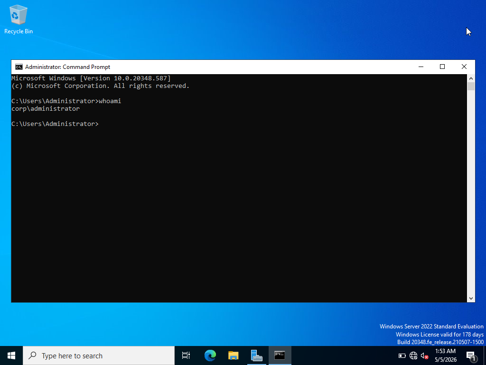
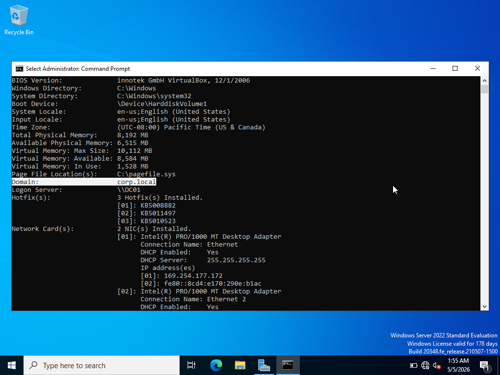

# Lab 01: Environment Setup

## Objective

This lab establishes the foundational infrastructure for the entire environment. It covers the installation and configuration of Windows Server 2022 in a virtualized environment, the deployment of Active Directory Domain Services (AD DS), and the promotion of the server to a Domain Controller. Every subsequent lab depends on this environment being correctly configured and operational.

---

## Environment Overview

| Setting | Value |
|---|---|
| Virtualization Platform | Oracle VirtualBox |
| Server OS | Windows Server 2022 Evaluation (Desktop Experience) |
| VM CPU | 2 cores |
| VM RAM | 8 GB |
| Server Name | DC01 |
| Domain Name | corp.local |
| Admin Account | corp\administrator |

---

## Phase 1: Virtual Machine Setup

### Step 1: Create the Virtual Machine

Created a new VM in VirtualBox with the following settings:

- **Name:** Server 2022
- **Type:** Microsoft Windows
- **Version:** Windows 2022 (64-bit)
- **Memory:** 8192 MB
- **CPU:** 2 cores
- **Disk:** 50 GB (dynamically allocated)


---

### Step 2: Install Windows Server 2022

Mounted the Windows Server 2022 ISO to the VM's optical drive and booted. During installation, selected **Windows Server 2022 Evaluation (Desktop Experience)**, which is required to get the full GUI. The Core option has no graphical interface and is not suitable for this lab.

Selected **Custom Install** and accepted the default partition layout.




---

### Step 3: Set Administrator Password and First Login

After installation completed and the server rebooted, set the local Administrator password. Pressed Ctrl+Alt+Delete to unlock the screen and logged in. Server Manager launched automatically, confirming the OS installed correctly.



---

## Phase 2: Initial Server Configuration

### Step 4: Rename the Server

The default server name is a random string assigned during installation. In real environments, servers are named by location and role. Renamed to **DC01** (Domain Controller 01).

- Opened Server Manager → Local Server → clicked the computer name
- Selected **Change** → set name to `DC01`
- Restarted to apply




---

## Phase 3: Active Directory Installation

### Step 5: Install the AD DS Role

With the server renamed and restarted, installed Active Directory Domain Services through Server Manager.

- Server Manager → Manage → **Add Roles and Features**
- Clicked Next through the wizard
- Selected **Active Directory Domain Services**
- Clicked **Add Features** when prompted
- Clicked Next → Next → **Install**

The AD DS installation itself is fast. The promotion step that follows takes longer.


---

### Step 6: Promote the Server to a Domain Controller

After installation, a warning flag appeared in Server Manager. Clicked it and selected **Promote this server to a domain controller**.

- Selected **Add a new forest**
- Set the Root domain name to: `corp.local`
- Set a Directory Services Restore Mode (DSRM) password
- Clicked through the remaining defaults and hit **Install**

The server restarted automatically after promotion. This step takes several minutes.

> **Note:** There are two ways to complete this step. The GUI wizard shown here is the straightforward approach. The wizard also generates a PowerShell script on the review screen that can be copied and run instead, which is the more advanced method.




---

### Step 7: Verify the Domain Controller

After the server restarted, the login screen showed **CORP\Administrator**, confirming the domain was created successfully.

Opened Command Prompt and ran the following to verify:

```
whoami
```

```
systeminfo
```

```
net user administrator /domain
```

These commands confirm the domain name, host name, OS version, and administrator account details.








---

## Outcome

Windows Server 2022 is fully installed, the server is named DC01, and it has been successfully promoted to a Domain Controller for the corp.local domain. Active Directory Users and Computers (ADUC) is accessible and ready for user management in Lab 02.
