# Lab 01: Environment Setup

## Objective

This lab establishes the foundation for the Active Directory lab environment. The goal is to install and configure Windows Server 2022 in Oracle VirtualBox. This lab also covers installing Active Directory Domain Services and promoting the server to a domain controller.

This setup is important because every future lab depends on this server working correctly. The domain controller will become the central system for the lab. It will manage users, groups, computers, Organizational Units, Group Policy, and domain-joined client machines.

By the end of this lab, Windows Server 2022 will be running in a virtual machine. The server will be renamed to `DC01` and configured as the first domain controller for the `corp.local` domain.

---

## Environment Overview

| Setting | Value |
|---|---|
| Virtualization Platform | Oracle VirtualBox |
| Server OS | Windows Server 2022 Evaluation, Desktop Experience |
| VM CPU | 2 cores |
| VM RAM | 8 GB |
| Virtual Disk | 50 GB dynamically allocated |
| Server Name | DC01 |
| Domain Name | corp.local |
| Admin Account | corp\administrator |

---

## Phase 1: Virtual Machine Setup

### Step 1: Create the Virtual Machine

The first step was to create a new virtual machine in Oracle VirtualBox. This VM will act as the Windows Server system for the lab. Later, this same server will be promoted to a domain controller.

The virtual machine was configured with enough resources to support Windows Server 2022, Server Manager, and Active Directory Domain Services without overwhelming a personal laptop.

| Setting | Value |
|---|---|
| Name | Server 2022 |
| Type | Microsoft Windows |
| Version | Windows 2022 64-bit |
| Memory | 8192 MB |
| CPU | 2 cores |
| Disk | 50 GB dynamically allocated |

---

### Screenshot 01: VM Creation Settings

| Field | Details |
|---|---|
| What it shows | The VM was created using the Windows Server 2022 64-bit profile. |
| Why it matters | Selecting the correct OS profile helps VirtualBox apply settings that match Windows Server. |

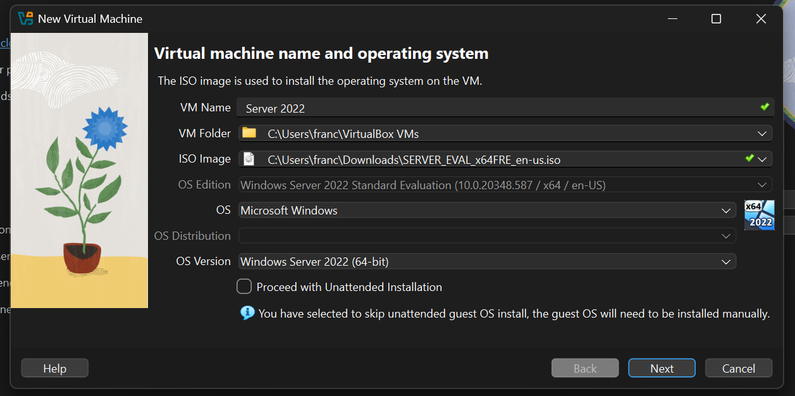

---

### Screenshot 02: VM Hardware Settings

| Field | Details |
|---|---|
| What it shows | The VM was assigned 8 GB of RAM and 2 CPU cores. |
| Why it matters | These resources help Windows Server and AD DS run smoothly during setup and management. |

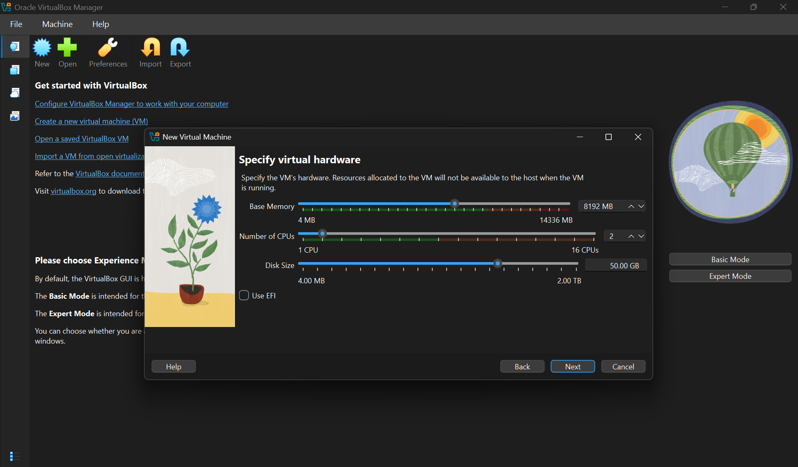

---

### Screenshot 03: VM Summary

| Field | Details |
|---|---|
| What it shows | The main VM settings were reviewed before launching the machine. |
| Why it matters | Reviewing the summary helps catch configuration mistakes before installing the operating system. |

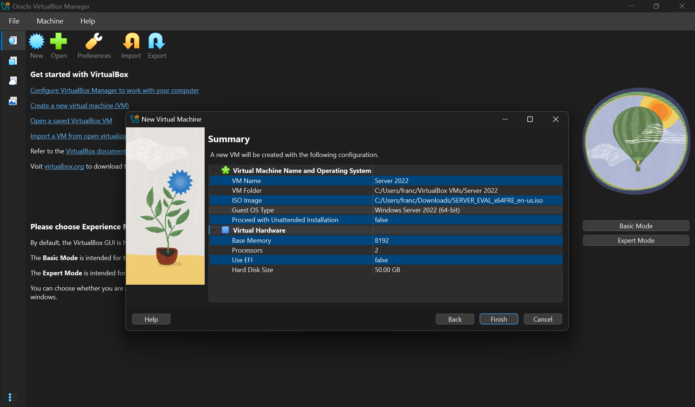

---

### Screenshot 04: VM Listed in VirtualBox

| Field | Details |
|---|---|
| What it shows | The virtual machine was successfully created and saved in VirtualBox. |
| Why it matters | This confirms the server environment exists and is ready to boot from the Windows Server ISO. |

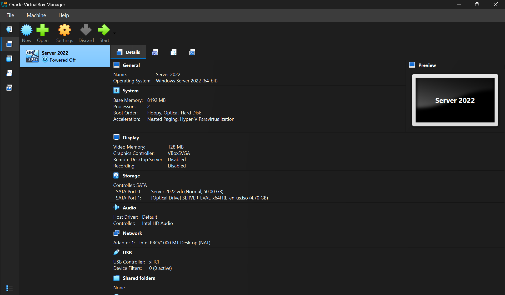

---

## Phase 2: Windows Server Installation

### Step 2: Install Windows Server 2022

After creating the virtual machine, the Windows Server 2022 ISO was mounted to the VM’s virtual optical drive. The VM was then started so it could boot into the Windows Server installation setup.

During installation, **Windows Server 2022 Evaluation, Desktop Experience** was selected. Desktop Experience includes the graphical user interface. This makes beginner administration tasks easier to complete and document.

The Server Core option was not selected because it does not include the full graphical interface. Server Core is useful in some professional environments, but Desktop Experience is better for this lab. It allows tools like Server Manager and Active Directory Users and Computers to be used visually.

---

### Screenshot 05: OS Edition Selection

| Field | Details |
|---|---|
| What it shows | Windows Server 2022 Desktop Experience was selected during installation. |
| Why it matters | The graphical interface is useful for this lab because most configuration steps use Server Manager and other GUI tools. |

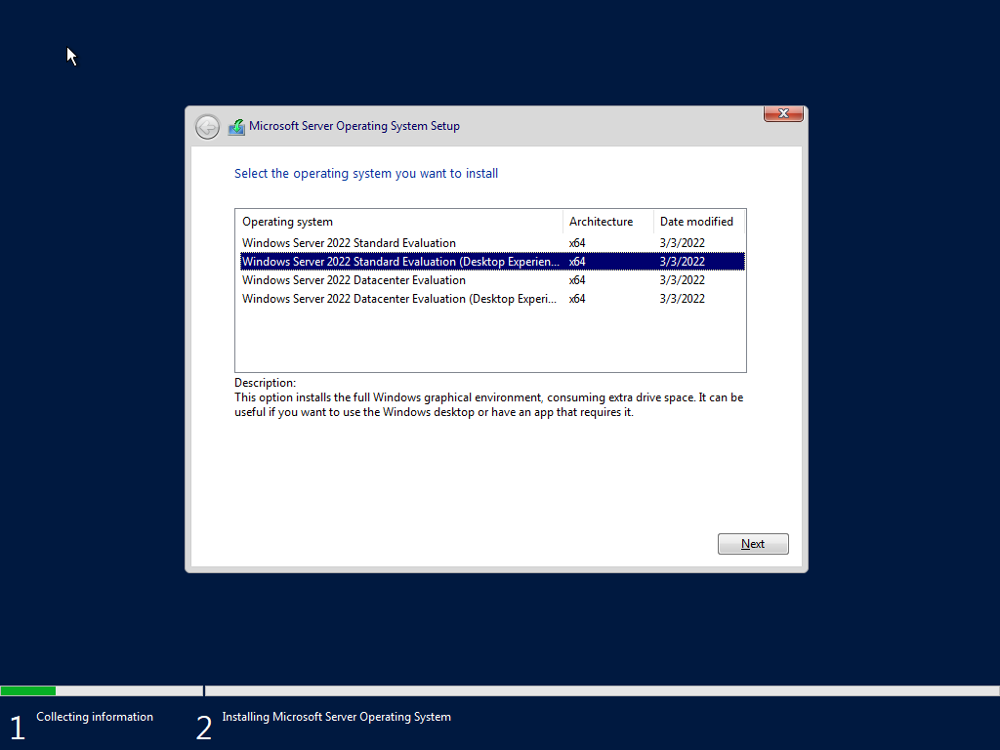

---

### Screenshot 06: Installation Progress

| Field | Details |
|---|---|
| What it shows | Windows Server 2022 was being installed onto the virtual disk. |
| Why it matters | This confirms the operating system installation started successfully inside the VM. |

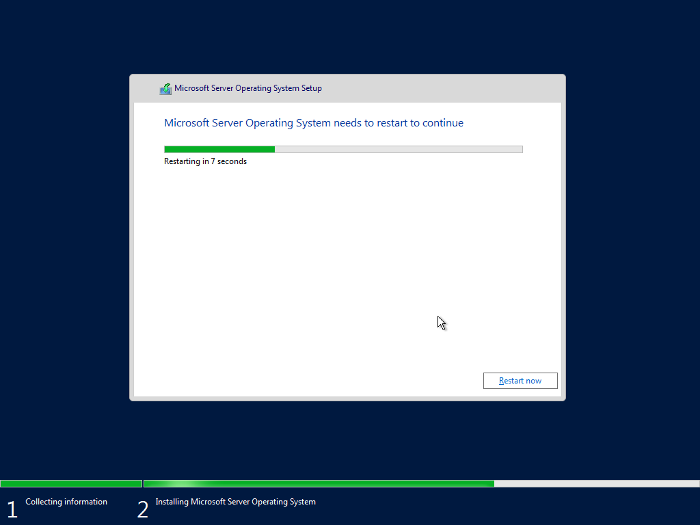

---

### Screenshot 07: Installation Restart

| Field | Details |
|---|---|
| What it shows | The server restarted as part of the installation process. |
| Why it matters | Restarts are expected during Windows Server installation and show that setup continued normally. |


---

### Step 3: Set Administrator Password and First Login

After the installation completed, the server restarted and prompted for a local Administrator password. This local Administrator account is used before the server becomes a domain controller.

After setting the password, the server was unlocked using **Ctrl + Alt + Delete**. The local Administrator account was then used to sign in. Once logged in, Server Manager opened automatically.

Server Manager is the main graphical tool used to configure Windows Server roles, features, and local server settings. Seeing it open after login confirmed that the operating system installed correctly and was ready for configuration.

---

### Screenshot 08: Server Manager First Login

| Field | Details |
|---|---|
| What it shows | Windows Server 2022 successfully loaded into the desktop environment. |
| Why it matters | Server Manager is the main tool used for installing roles, managing settings, and preparing the machine for Active Directory. |


---

## Phase 3: Initial Server Configuration

### Step 4: Rename the Server

After Windows Server was installed, the next step was to rename the server. By default, Windows Server assigns a random computer name during installation. Random names are difficult to identify and manage, especially as more machines are added to the lab.

In real IT environments, servers are usually named based on their role, location, or purpose. For this lab, the server was renamed to **DC01**, which stands for **Domain Controller 01**.

This naming convention makes the environment easier to understand. It also prepares the lab for future systems, such as domain-joined Windows client machines.

The server was renamed by following this path:

1. Opened **Server Manager**
2. Selected **Local Server**
3. Clicked the current computer name
4. Selected **Change**
5. Renamed the server to `DC01`
6. Restarted the server to apply the change

---

### Screenshot 09: Random Server Name Before Rename

| Field | Details |
|---|---|
| What it shows | Windows Server still had the default computer name assigned during installation. |
| Why it matters | This shows why renaming was necessary before building the domain environment. |

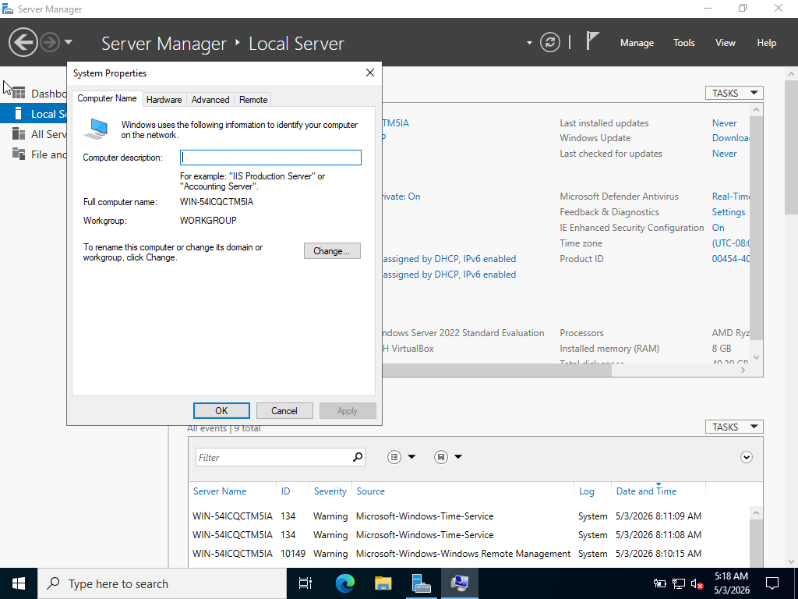

---

### Screenshot 10: Server Renamed to DC01

| Field | Details |
|---|---|
| What it shows | The server name was changed from the default random name to `DC01`. |
| Why it matters | A clear server name identifies the machine as the first domain controller and makes the lab easier to manage. |


---

## Phase 4: Active Directory Installation

### Step 5: Install the Active Directory Domain Services Role

After renaming and restarting the server, the next step was to install the **Active Directory Domain Services** role.

Active Directory Domain Services, also called **AD DS**, is the Windows Server role that allows a server to provide directory services for a domain. It stores and manages information about users, groups, computers, and other network resources.

Installing AD DS is required before the server can become a domain controller. However, installing the role alone does not complete the setup. The server still has to be promoted to a domain controller after the role is installed.

AD DS was installed through Server Manager using the Add Roles and Features wizard:

1. Opened **Server Manager**
2. Clicked **Manage**
3. Selected **Add Roles and Features**
4. Continued through the wizard
5. Selected **Active Directory Domain Services**
6. Clicked **Add Features** when prompted
7. Continued through the remaining wizard pages
8. Clicked **Install**

---

### Screenshot 11: AD DS Role Selected

| Field | Details |
|---|---|
| What it shows | Active Directory Domain Services was selected in the Add Roles and Features wizard. |
| Why it matters | This role is required before Windows Server can be promoted to a domain controller. |

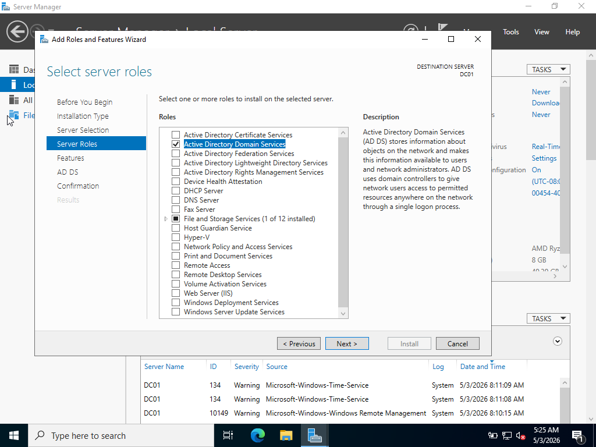

---

### Step 6: Promote the Server to a Domain Controller

After the AD DS role was installed, Server Manager displayed a warning flag. This appeared because the role was installed, but the server had not yet been promoted to a domain controller.

Promotion is the step that actually turns the Windows Server machine into a domain controller. Since this was the first domain controller in the lab, a new forest was created.

For this lab, the root domain name was set to:

```text
corp.local
```

A forest is the top-level structure in Active Directory. Since this lab starts from scratch, creating a new forest also creates the first domain inside that forest.

The domain name `corp.local` was used because it is simple, recognizable, and appropriate for a private lab environment.

The following configuration was used during promotion:

| Setting | Value |
|---|---|
| Deployment Operation | Add a new forest |
| Root Domain Name | corp.local |
| Domain Controller Role | DNS server and Global Catalog |
| DSRM Password | Configured during promotion |
| Remaining Settings | Default values |

---

### Screenshot 12: Domain Controller Options

| Field | Details |
|---|---|
| What it shows | The server was being configured with domain controller services. |
| Why it matters | This confirms the promotion process was preparing the server to run core Active Directory functions. |

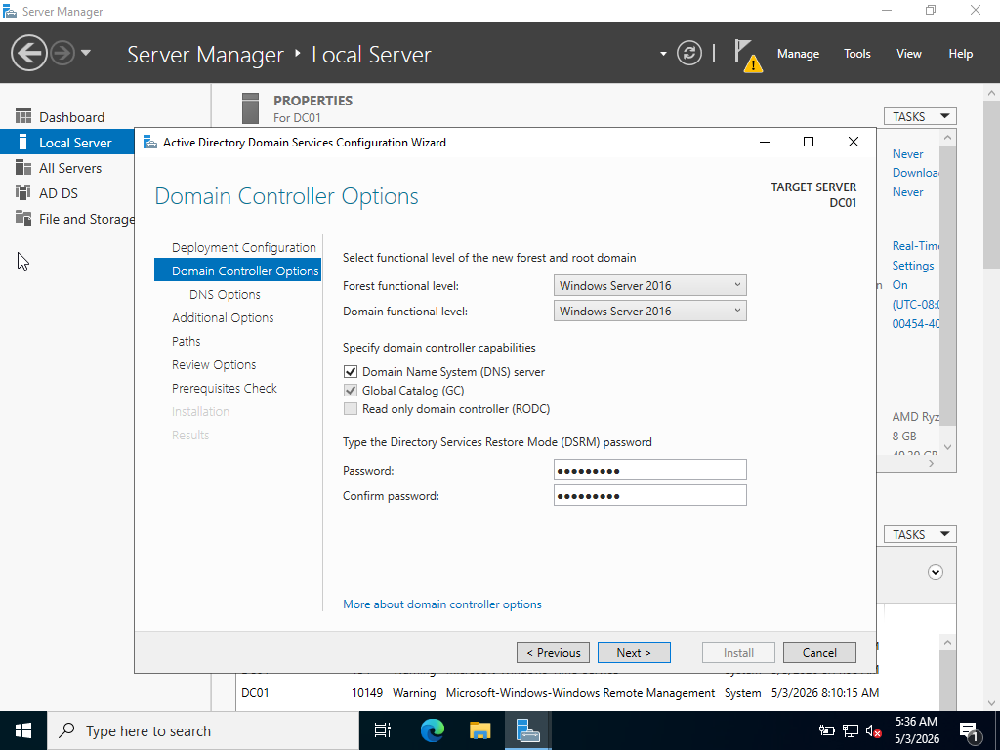

---

### Screenshot 13: New Forest Configuration

| Field | Details |
|---|---|
| What it shows | A new Active Directory forest and domain were being created using `corp.local`. |
| Why it matters | This establishes the domain that future users, groups, computers, and policies will belong to. |

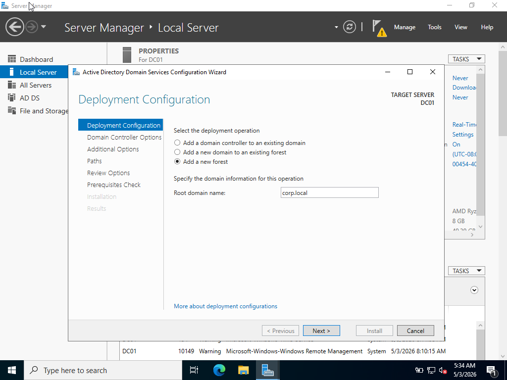

---

### Screenshot 14: Prerequisites Check

| Field | Details |
|---|---|
| What it shows | Windows Server accepted the configuration before promotion. |
| Why it matters | Passing the prerequisites check means the server was ready to become a domain controller. |


---

After the prerequisites check passed, **Install** was selected. The server restarted automatically after the promotion completed. This restart is expected because the server changes from a standalone server into a domain controller.

---

## Phase 5: Domain Controller Verification

### Step 7: Verify Domain Login

After the server restarted, the login screen showed **CORP\Administrator**. This confirmed that the server was now using the domain Administrator account instead of only the local Administrator account.

Before promotion, the server used a local Administrator account. After promotion, the Administrator account became part of the domain. This change confirmed that the `corp.local` domain was created successfully.

---

### Screenshot 15: Domain Login Screen

| Field | Details |
|---|---|
| What it shows | The login screen showed the `CORP\Administrator` domain account. |
| Why it matters | This is one of the first visual confirmations that the server was successfully promoted to a domain controller. |


---

### Step 8: Verify Domain Identity Using Command Prompt

After logging in, Command Prompt was used to verify the domain controller configuration. These commands provided command-line proof that the server name, domain membership, and Administrator account were configured correctly.

Command-line verification is important because it confirms the configuration outside of the graphical interface.

The first command used was:

```cmd
whoami
```

This command shows the account currently being used in the session.

---

### Screenshot 16: whoami Output

| Field | Details |
|---|---|
| What it shows | The current session was running under the domain Administrator account. |
| Why it matters | This confirms the user was logged into the domain context instead of only a local machine account. |


---

The second command used was:

```cmd
systeminfo
```

This command displays detailed system information, including the host name, operating system version, and domain membership.

---

### Screenshot 17: systeminfo Output

| Field | Details |
|---|---|
| What it shows | The server name and domain membership were visible from the command line. |
| Why it matters | This verifies that the server is named `DC01` and belongs to the `corp.local` domain. |


---

The third command used was:

```cmd
net user administrator /domain
```

This command checks the Administrator account from the domain instead of only checking a local user account.

---

### Screenshot 18: net user Domain Output

| Field | Details |
|---|---|
| What it shows | The domain Administrator account could be queried from the domain controller. |
| Why it matters | This confirms that the Administrator account exists in the domain and that domain account lookup is working. |

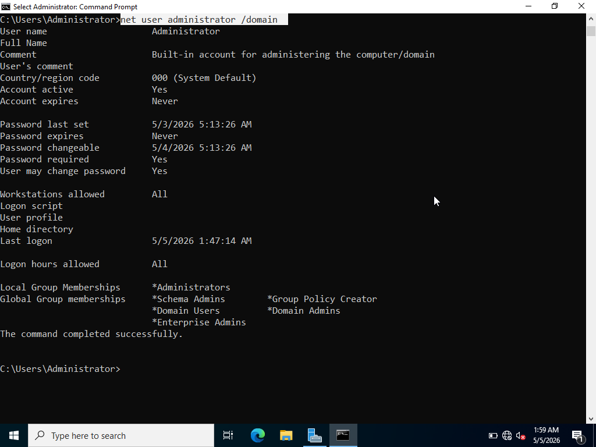

---

### Step 9: Verify Active Directory Users and Computers

The final verification step was to open **Active Directory Users and Computers**.

Active Directory Users and Computers is one of the main tools used to manage a Windows domain. It allows administrators to view and manage users, groups, computers, and Organizational Units.

This tool will be used heavily in future labs when creating users, organizing accounts into OUs, managing groups, and applying Group Policy.

---

### Screenshot 19: Active Directory Users and Computers

| Field | Details |
|---|---|
| What it shows | The Active Directory Users and Computers console was available on the server. |
| Why it matters | This confirms that the AD DS management tools were installed and that the domain can be managed through the graphical interface. |

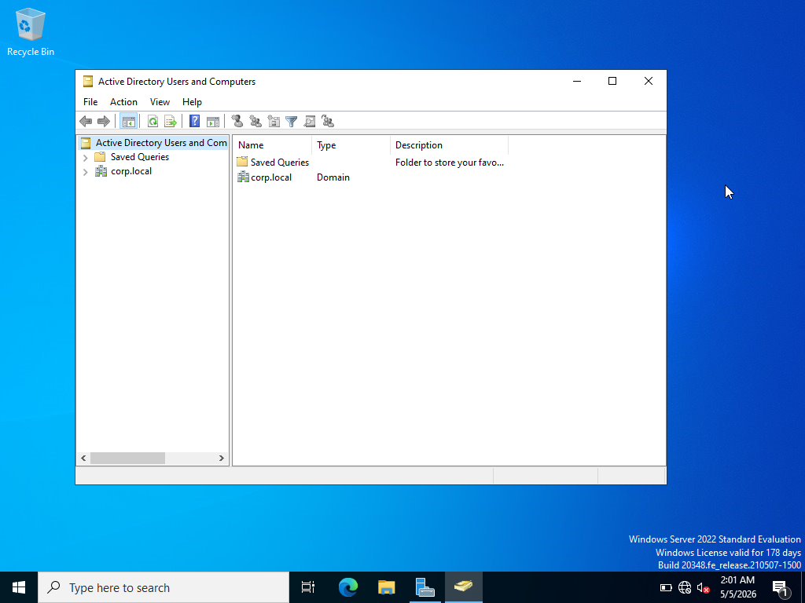

---

## Outcome

Windows Server 2022 is fully installed, the server is named `DC01`, and it has been successfully promoted to a domain controller for the `corp.local` domain. Active Directory Users and Computers is accessible and ready for user management in Lab 02.
